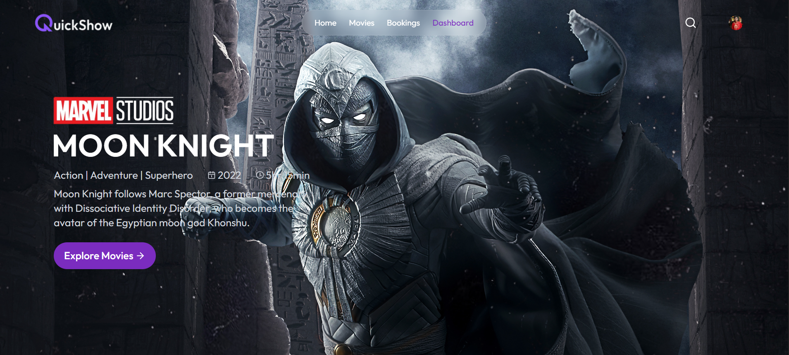
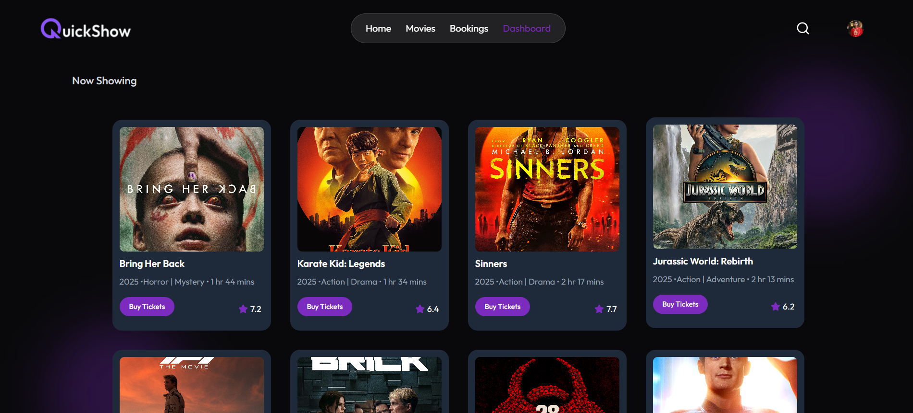
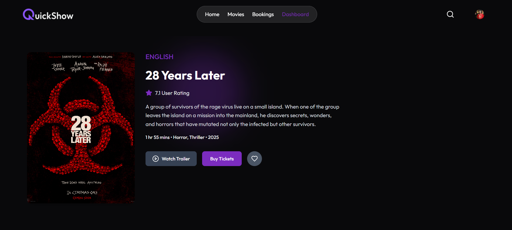
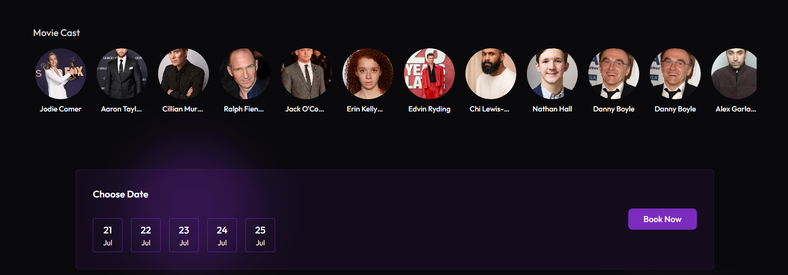
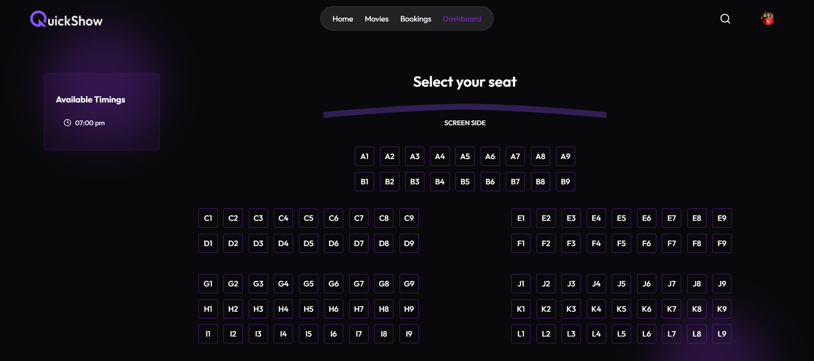
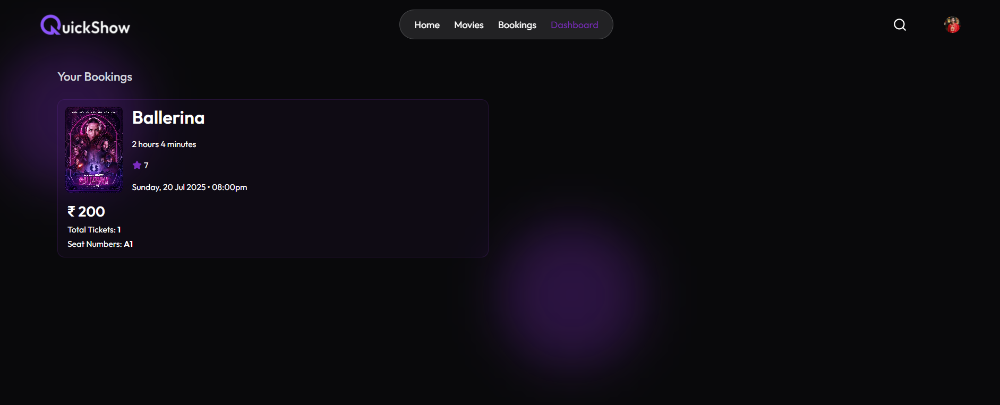
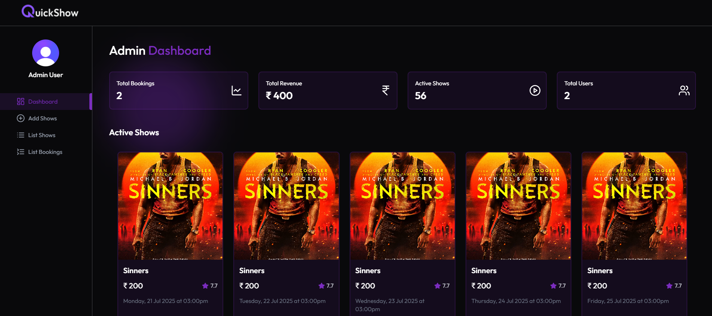
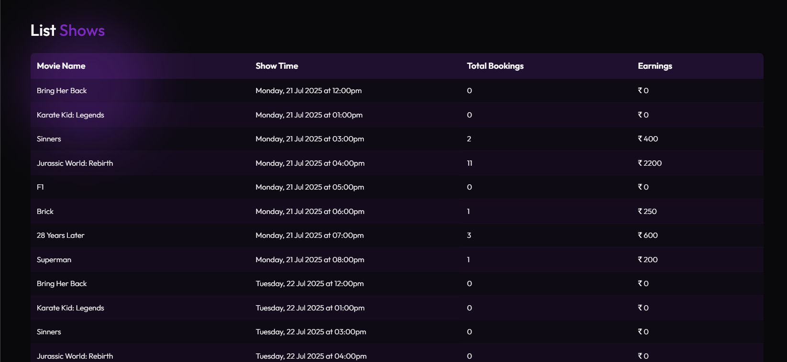
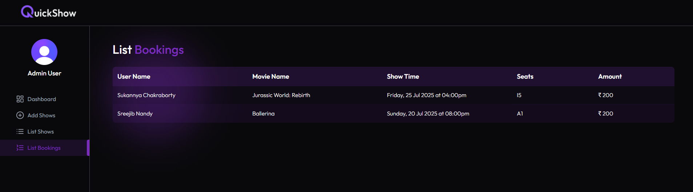

# 🎬 QuickShow – MERN Movie Ticket Booking System

A fully functional full-stack **MERN** movie ticket booking web application built using **Clerk**, **Stripe**, **Nodemailer**, and **Inngest** to deliver a seamless, secure, and modern movie booking experience.

🔗 [Live Demo](https://quickshow-neon.vercel.app/)

---

## 🚀 Features

- 🎟️ **Book Tickets** with Live Seat Selection
- 🔐 **User Authentication** via Clerk (Email, Phone, Social logins)
- 💳 **Secure Online Payments** using Stripe
- 📧 **Email Notifications** powered by Nodemailer
- ⏱️ **Background Jobs & Scheduling** using Inngest
- 🧾 **Admin Dashboard** for Movie, Show & Booking Management
- 📊 **Monthly Analytics** for Revenue and Bookings
- 🔁 **Multi-Session Switching** without Signing Out

---

## 🧰 Tech Stack

### 🖥️ Frontend
- React.js
- Vite
- Tailwind CSS

### ⚙️ Backend
- Node.js + Express.js
- MongoDB (Mongoose)
- Clerk (Auth)
- Stripe (Payments)
- Nodemailer (Emails)
- Inngest (Background Jobs)

---

## 🔁 Booking Flow

1. User logs in via Clerk.
2. Browses movies and selects showtime.
3. Chooses preferred seats.
4. Proceeds to secure payment using Stripe.
5. If payment fails:
   - Seats are held for **10 minutes**.
   - If payment is not completed, the seats are automatically released.
6. On successful booking:
   - Confirmation email sent.
   - Reminder email sent before showtime.

---

## 📬 Email Notifications (via Nodemailer & Inngest)

- 🎞️ New movie added → notify all users.
- ✅ Booking confirmation email.
- ⏰ Reminder email before showtime.
- Emails scheduled and triggered using **Inngest background jobs**.

---

## 🛠️ Admin Features

- Add, edit, or remove movies.
- Manage bookings.
- View total revenue and booking analytics.
- Track performance using monthly reports.

---

## 📸 Screenshots

### Home Page

### Movies Page

### Movie Details Page

### Cast & Dates

### Seat Layout Page

### Bookings Page

### Dashboard Page

### List Shows Page

### List Bookings Page

---

## 🙌 Contributing

Contributions are welcome! Please fork the repo and open a pull request for any improvements or feature suggestions.

---

## 📧 Contact

- **Developer**: Ashish Kumar Pandey  
- **Email**: [0203ashish2004@gmail.com](0203ashish2004@gmail.com)

---

## 📄 License

Licensed under the [MIT License](LICENSE).

---

> Built with ❤️ using MERN, Clerk, Inngest, Stripe & Nodemailer

